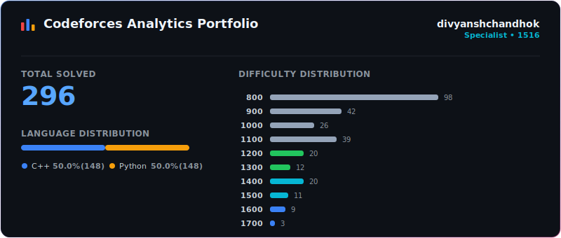

# Codeforces Solutions Portfolio

This repository automatically syncs my accepted solutions to Codeforces problems, organizing each with its problem statement, constraints, sample tests, and tags.

It also features my competitive programming starter template ([template.cpp](template.cpp)) and a custom debugging utility ([debug.cpp](debug.cpp)). The debug script pretty-prints standard library containers, nested data structures (e.g. vectors of vectors, sets, maps, tuples), and primitive types to `stderr` with optional terminal color formatting for easy local testing.

## 📊 Statistics

  

## 🏆 Solved Problems

| # | Problem | Difficulty | Language | Tags | Solved Date | Solution |
| :---: | :--- | :---: | :---: | :--- | :---: | :---: |
| 1 | [2236B - Tatar TV Show](problems/2236B/README.md) | **800** | C++23 (GCC 14-64, msys2) | `greedy`, `math`, `strings` | 2026-06-13 23:59 | [Code](problems/2236B/solution.cpp) |
| 2 | [2236A - Games on the Train](problems/2236A/README.md) | **800** | C++23 (GCC 14-64, msys2) | `greedy`, `math` | 2026-06-13 23:48 | [Code](problems/2236A/solution.cpp) |
| 3 | [670D2 - Magic Powder - 2](problems/670D2/README.md) | **1500** | C++23 (GCC 14-64, msys2) | `binary search`, `implementation` | 2026-02-23 15:12 | [Code](problems/670D2/solution.cpp) |
| 4 | [670D1 - Magic Powder - 1](problems/670D1/README.md) | **1400** | C++23 (GCC 14-64, msys2) | `binary search`, `brute force`, `implementation` | 2026-02-23 14:50 | [Code](problems/670D1/solution.cpp) |
| 5 | [1613C - Poisoned Dagger](problems/1613C/README.md) | **1200** | C++23 (GCC 14-64, msys2) | `binary search` | 2026-02-23 08:38 | [Code](problems/1613C/solution.cpp) |
| 6 | [287B - Pipeline](problems/287B/README.md) | **1700** | C++23 (GCC 14-64, msys2) | `binary search`, `math` | 2026-02-23 08:30 | [Code](problems/287B/solution.cpp) |
| 7 | [371C - Hamburgers](problems/371C/README.md) | **1600** | C++23 (GCC 14-64, msys2) | `binary search`, `brute force` | 2026-02-23 07:28 | [Code](problems/371C/solution.cpp) |
| 8 | [2192C - All-in-one Gun](problems/2192C/README.md) | **1300** | C++23 (GCC 14-64, msys2) | `binary search`, `greedy`, `math` | 2026-02-22 02:54 | [Code](problems/2192C/solution.cpp) |
| 9 | [2192B - Flipping Binary String](problems/2192B/README.md) | **1000** | C++23 (GCC 14-64, msys2) | `constructive algorithms`, `strings` | 2026-02-22 02:09 | [Code](problems/2192B/solution.cpp) |
| 10 | [2192A - String Rotation Game](problems/2192A/README.md) | **800** | C++23 (GCC 14-64, msys2) | `brute force`, `strings` | 2026-02-22 01:53 | [Code](problems/2192A/solution.cpp) |
| 11 | [1312B - Bogosort](problems/1312B/README.md) | **1000** | C++23 (GCC 14-64, msys2) | `constructive algorithms`, `sortings` | 2026-02-21 13:40 | [Code](problems/1312B/solution.cpp) |
| 12 | [1155A - Reverse a Substring](problems/1155A/README.md) | **1000** | C++23 (GCC 14-64, msys2) | `implementation`, `sortings`, `strings` | 2026-02-21 13:33 | [Code](problems/1155A/solution.cpp) |
| 13 | [1411B - Fair Numbers](problems/1411B/README.md) | **1000** | C++23 (GCC 14-64, msys2) | `brute force`, `number theory` | 2026-02-21 13:21 | [Code](problems/1411B/solution.cpp) |
| 14 | [1418A - Buying Torches](problems/1418A/README.md) | **1000** | C++23 (GCC 14-64, msys2) | `math` | 2026-02-21 12:27 | [Code](problems/1418A/solution.cpp) |
| 15 | [1831B - Array merging](problems/1831B/README.md) | **1000** | C++23 (GCC 14-64, msys2) | `constructive algorithms`, `greedy` | 2026-02-21 04:53 | [Code](problems/1831B/solution.cpp) |
| 16 | [1725B - Basketball Together](problems/1725B/README.md) | **1000** | C++23 (GCC 14-64, msys2) | `binary search`, `greedy`, `sortings` | 2026-02-20 15:09 | [Code](problems/1725B/solution.cpp) |
| 17 | [1744C - Traffic Light](problems/1744C/README.md) | **1000** | C++23 (GCC 14-64, msys2) | `binary search`, `implementation`, `two pointers` | 2026-02-20 14:00 | [Code](problems/1744C/solution.cpp) |
| 18 | [1840C - Ski Resort](problems/1840C/README.md) | **1000** | C++23 (GCC 14-64, msys2) | `combinatorics`, `math`, `two pointers` | 2026-02-20 13:25 | [Code](problems/1840C/solution.cpp) |
| 19 | [2195D - Absolute Cinema](problems/2195D/README.md) | **1300** | C++23 (GCC 14-64, msys2) | `math` | 2026-02-19 20:38 | [Code](problems/2195D/solution.cpp) |
| 20 | [2195C - Dice Roll Sequence](problems/2195C/README.md) | **1100** | C++23 (GCC 14-64, msys2) | `dp`, `greedy` | 2026-02-19 19:22 | [Code](problems/2195C/solution.cpp) |
| 21 | [2195B - Heapify 1](problems/2195B/README.md) | **900** | C++23 (GCC 14-64, msys2) | `implementation`, `sortings` | 2026-02-19 18:41 | [Code](problems/2195B/solution.cpp) |
| 22 | [2195A - Sieve of Erato67henes](problems/2195A/README.md) | **800** | C++23 (GCC 14-64, msys2) | `math`, `number theory` | 2026-02-19 18:02 | [Code](problems/2195A/solution.cpp) |
| 23 | [1883C - Raspberries](problems/1883C/README.md) | **1000** | C++23 (GCC 14-64, msys2) | `dp`, `math` | 2026-02-19 17:56 | [Code](problems/1883C/solution.py) |
| 24 | [1913B - Swap and Delete](problems/1913B/README.md) | **1000** | C++23 (GCC 14-64, msys2) | `strings` | 2026-02-19 17:46 | [Code](problems/1913B/solution.py) |
| 25 | [1675B - Make It Increasing](problems/1675B/README.md) | **900** | C++23 (GCC 14-64, msys2) | `greedy`, `implementation` | 2026-02-19 17:26 | [Code](problems/1675B/solution.cpp) |
| 26 | [1582B - Luntik and Subsequences](problems/1582B/README.md) | **900** | C++23 (GCC 14-64, msys2) | `combinatorics`, `math` | 2026-02-19 17:03 | [Code](problems/1582B/solution.cpp) |
| 27 | [1666D - Deletive Editing](problems/1666D/README.md) | **900** | C++23 (GCC 14-64, msys2) | `greedy` | 2026-02-19 16:56 | [Code](problems/1666D/solution.cpp) |
| 28 | [1665B - Array Cloning Technique](problems/1665B/README.md) | **900** | C++23 (GCC 14-64, msys2) | `constructive algorithms`, `greedy`, `sortings` | 2026-02-19 16:32 | [Code](problems/1665B/solution.cpp) |
| 29 | [2185D - OutOfMemoryError](problems/2185D/README.md) | **1100** | C++23 (GCC 14-64, msys2) | `data structures`, `implementation`, `math`, `two pointers` | 2026-02-06 21:06 | [Code](problems/2185D/solution.cpp) |
| 30 | [2185C - Shifted MEX](problems/2185C/README.md) | **900** | C++23 (GCC 14-64, msys2) | `implementation`, `sortings` | 2026-02-06 20:47 | [Code](problems/2185C/solution.cpp) |
| 31 | [2185B - Prefix Max](problems/2185B/README.md) | **800** | C++23 (GCC 14-64, msys2) | `greedy` | 2026-02-06 20:37 | [Code](problems/2185B/solution.cpp) |
| 32 | [2185A - Perfect Root](problems/2185A/README.md) | **800** | C++23 (GCC 14-64, msys2) | `constructive algorithms`, `math` | 2026-02-06 20:35 | [Code](problems/2185A/solution.cpp) |
| 33 | [1931D - Divisible Pairs](problems/1931D/README.md) | **1300** | C++23 (GCC 14-64, msys2) | `combinatorics`, `math`, `number theory` | 2026-02-06 03:07 | [Code](problems/1931D/solution.cpp) |
| 34 | [1872D - Plus Minus Permutation](problems/1872D/README.md) | **1200** | C++23 (GCC 14-64, msys2) | `math` | 2026-02-06 01:18 | [Code](problems/1872D/solution.cpp) |
| 35 | [1620B - Triangles on a Rectangle](problems/1620B/README.md) | **1000** | C++23 (GCC 14-64, msys2) | `geometry`, `greedy`, `math` | 2026-02-05 22:46 | [Code](problems/1620B/solution.cpp) |
| 36 | [1726A - Mainak and Array](problems/1726A/README.md) | **900** | C++23 (GCC 14-64, msys2) | `greedy`, `math` | 2026-02-05 22:26 | [Code](problems/1726A/solution.cpp) |
| 37 | [1900A - Cover in Water](problems/1900A/README.md) | **800** | C++23 (GCC 14-64, msys2) | `constructive algorithms`, `greedy`, `implementation`, `strings` | 2026-02-05 22:16 | [Code](problems/1900A/solution.py) |
| 38 | [1106D - Lunar New Year and a Wander](problems/1106D/README.md) | **1500** | C++23 (GCC 14-64, msys2) | `data structures`, `dfs and similar`, `graphs`, `greedy`, `shortest paths` | 2026-01-31 23:14 | [Code](problems/1106D/solution.cpp) |
| 39 | [1084C - The Fair Nut and String](problems/1084C/README.md) | **1500** | C++23 (GCC 14-64, msys2) | `combinatorics`, `dp`, `implementation` | 2026-01-31 14:19 | [Code](problems/1084C/solution.cpp) |
| 40 | [891A - Pride](problems/891A/README.md) | **1500** | C++23 (GCC 14-64, msys2) | `brute force`, `dp`, `greedy`, `math`, `number theory` | 2026-01-31 02:06 | [Code](problems/891A/solution.cpp) |
| 41 | [845C - Two TVs](problems/845C/README.md) | **1500** | C++23 (GCC 14-64, msys2) | `data structures`, `greedy`, `sortings` | 2026-01-30 21:50 | [Code](problems/845C/solution.cpp) |
| 42 | [808B - Average Sleep Time](problems/808B/README.md) | **1300** | C++23 (GCC 14-64, msys2) | `data structures`, `implementation`, `math` | 2026-01-30 21:28 | [Code](problems/808B/solution.cpp) |
| 43 | [2193D - Monster Game](problems/2193D/README.md) | **1100** | C++23 (GCC 14-64, msys2) | `binary search`, `sortings`, `two pointers` | 2026-01-29 12:08 | [Code](problems/2193D/solution.cpp) |
| 44 | [2193C - Replace and Sum](problems/2193C/README.md) | **1000** | C++23 (GCC 14-64, msys2) | `data structures`, `greedy` | 2026-01-29 05:33 | [Code](problems/2193C/solution.cpp) |
| 45 | [2193B - Reverse a Permutation](problems/2193B/README.md) | **800** | C++23 (GCC 14-64, msys2) | `greedy` | 2026-01-28 23:52 | [Code](problems/2193B/solution.cpp) |
| 46 | [2193A - DBMB and the Array](problems/2193A/README.md) | **800** | C++23 (GCC 14-64, msys2) | `brute force`, `math` | 2026-01-28 20:30 | [Code](problems/2193A/solution.cpp) |
| 47 | [1648A - Weird Sum](problems/1648A/README.md) | **1400** | C++23 (GCC 14-64, msys2) | `combinatorics`, `data structures`, `geometry`, `math`, `matrices`, `sortings` | 2026-01-14 19:09 | [Code](problems/1648A/solution.cpp) |
| 48 | [1701C - Schedule Management](problems/1701C/README.md) | **1400** | C++23 (GCC 14-64, msys2) | `binary search`, `greedy`, `implementation`, `two pointers` | 2026-01-14 17:39 | [Code](problems/1701C/solution.cpp) |
| 49 | [1881D - Divide and Equalize](problems/1881D/README.md) | **1300** | C++23 (GCC 14-64, msys2) | `math`, `number theory` | 2025-11-15 12:43 | [Code](problems/1881D/solution.cpp) |
| 50 | [1879C - Make it Alternating](problems/1879C/README.md) | **1300** | C++23 (GCC 14-64, msys2) | `combinatorics`, `dp`, `greedy` | 2025-11-15 11:51 | [Code](problems/1879C/solution.cpp) |
| 51 | [492A - Vanya and Cubes](problems/492A/README.md) | **800** | C++23 (GCC 14-64, msys2) | `implementation` | 2025-09-06 10:03 | [Code](problems/492A/solution.cpp) |
| 52 | [2134C - Even Larger](problems/2134C/README.md) | **1200** | C++23 (GCC 14-64, msys2) | `brute force`, `greedy`, `implementation` | 2025-08-26 20:38 | [Code](problems/2134C/solution.cpp) |
| 53 | [2134B - Add 0 or K](problems/2134B/README.md) | **1200** | C++23 (GCC 14-64, msys2) | `constructive algorithms`, `math`, `number theory` | 2025-08-26 20:23 | [Code](problems/2134B/solution.cpp) |
| 54 | [2134A - Painting With Two Colors](problems/2134A/README.md) | **800** | C++23 (GCC 14-64, msys2) | `constructive algorithms`, `implementation`, `math` | 2025-08-26 20:09 | [Code](problems/2134A/solution.cpp) |
| 55 | [1986B - Matrix Stabilization](problems/1986B/README.md) | **1000** | C++23 (GCC 14-64, msys2) | `brute force`, `data structures`, `greedy`, `sortings` | 2025-08-26 19:13 | [Code](problems/1986B/solution.cpp) |
| 56 | [1921A - Square](problems/1921A/README.md) | **800** | C++23 (GCC 14-64, msys2) | `greedy`, `math` | 2025-08-26 18:50 | [Code](problems/1921A/solution.cpp) |
| 57 | [2025A - Two Screens](problems/2025A/README.md) | **800** | C++23 (GCC 14-64, msys2) | `binary search`, `greedy`, `strings`, `two pointers` | 2025-08-26 18:45 | [Code](problems/2025A/solution.cpp) |
| 58 | [2127A - Mix Mex Max](problems/2127A/README.md) | **800** | C++23 (GCC 14-64, msys2) | `constructive algorithms`, `greedy`, `math` | 2025-08-26 10:53 | [Code](problems/2127A/solution.cpp) |
| 59 | [2084B - MIN = GCD](problems/2084B/README.md) | **1100** | C++23 (GCC 14-64, msys2) | `greedy`, `math`, `number theory` | 2025-08-25 01:40 | [Code](problems/2084B/solution.cpp) |
| 60 | [2133C - The Nether](problems/2133C/README.md) | **1400** | C++23 (GCC 14-64, msys2) | `graphs`, `interactive` | 2025-08-24 21:04 | [Code](problems/2133C/solution.cpp) |
| 61 | [2133B - Villagers](problems/2133B/README.md) | **800** | C++23 (GCC 14-64, msys2) | `greedy` | 2025-08-24 20:22 | [Code](problems/2133B/solution.cpp) |
| 62 | [2133A - Redstone?](problems/2133A/README.md) | **800** | C++23 (GCC 14-64, msys2) | `brute force`, `data structures`, `implementation`, `math` | 2025-08-24 20:15 | [Code](problems/2133A/solution.cpp) |
| 63 | [2132C2 - The Cunning Seller (hard version)](problems/2132C2/README.md) | **1400** | C++23 (GCC 14-64, msys2) | `binary search`, `greedy`, `math` | 2025-08-21 22:09 | [Code](problems/2132C2/solution.cpp) |
| 64 | [2132C1 - The Cunning Seller (easy version)](problems/2132C1/README.md) | **1000** | C++23 (GCC 14-64, msys2) | `greedy`, `math` | 2025-08-21 20:52 | [Code](problems/2132C1/solution.cpp) |
| 65 | [2132B - The Secret Number](problems/2132B/README.md) | **900** | C++23 (GCC 14-64, msys2) | `math` | 2025-08-21 20:39 | [Code](problems/2132B/solution.cpp) |
| 66 | [2132A - Homework](problems/2132A/README.md) | **800** | C++23 (GCC 14-64, msys2) | `brute force`, `implementation`, `strings` | 2025-08-21 20:09 | [Code](problems/2132A/solution.cpp) |
| 67 | [1855B - Longest Divisors Interval](problems/1855B/README.md) | **900** | C++23 (GCC 14-64, msys2) | `brute force`, `combinatorics`, `greedy`, `math`, `number theory` | 2025-08-20 01:06 | [Code](problems/1855B/solution.cpp) |
| 68 | [1440B - Sum of Medians](problems/1440B/README.md) | **900** | C++23 (GCC 14-64, msys2) | `greedy`, `math` | 2025-08-20 01:01 | [Code](problems/1440B/solution.cpp) |
| 69 | [1559A - Mocha and Math](problems/1559A/README.md) | **900** | C++23 (GCC 14-64, msys2) | `bitmasks`, `constructive algorithms`, `math` | 2025-08-20 00:49 | [Code](problems/1559A/solution.cpp) |
| 70 | [1537B - Bad Boy](problems/1537B/README.md) | **900** | C++23 (GCC 14-64, msys2) | `constructive algorithms`, `greedy`, `math` | 2025-08-20 00:42 | [Code](problems/1537B/solution.cpp) |
| 71 | [1606A - AB Balance](problems/1606A/README.md) | **900** | C++23 (GCC 14-64, msys2) | `strings` | 2025-08-20 00:33 | [Code](problems/1606A/solution.cpp) |
| 72 | [1607B - Odd Grasshopper](problems/1607B/README.md) | **900** | C++23 (GCC 14-64, msys2) | `math` | 2025-08-20 00:22 | [Code](problems/1607B/solution.cpp) |
| 73 | [1471A - Strange Partition](problems/1471A/README.md) | **900** | C++23 (GCC 14-64, msys2) | `greedy`, `math`, `number theory` | 2025-08-19 23:49 | [Code](problems/1471A/solution.cpp) |
| 74 | [1380A - Three Indices](problems/1380A/README.md) | **900** | C++23 (GCC 14-64, msys2) | `brute force`, `data structures` | 2025-08-19 23:44 | [Code](problems/1380A/solution.cpp) |
| 75 | [1373B - 01 Game](problems/1373B/README.md) | **900** | C++23 (GCC 14-64, msys2) | `games` | 2025-08-19 23:37 | [Code](problems/1373B/solution.cpp) |
| 76 | [1881E - Block Sequence](problems/1881E/README.md) | **1500** | C++23 (GCC 14-64, msys2) | `dp` | 2025-08-19 23:17 | [Code](problems/1881E/solution.cpp) |
| 77 | [1167C - News Distribution](problems/1167C/README.md) | **1400** | C++23 (GCC 14-64, msys2) | `dfs and similar`, `dsu`, `graphs` | 2025-08-19 20:24 | [Code](problems/1167C/solution.cpp) |
| 78 | [1828B - Permutation Swap](problems/1828B/README.md) | **900** | C++23 (GCC 14-64, msys2) | `math`, `number theory` | 2025-08-19 19:47 | [Code](problems/1828B/solution.cpp) |
| 79 | [1593B - Make it Divisible by 25](problems/1593B/README.md) | **900** | C++23 (GCC 14-64, msys2) | `dfs and similar`, `dp`, `greedy`, `math` | 2025-08-19 19:38 | [Code](problems/1593B/solution.cpp) |
| 80 | [219158Z - Hard Compare](problems/219158Z/README.md) | **N/A** | C++23 (GCC 14-64, msys2) |  | 2025-08-14 16:51 | [Code](problems/219158Z/solution.cpp) |
| 81 | [813C - The Tag Game](problems/813C/README.md) | **1700** | C++23 (GCC 14-64, msys2) | `dfs and similar`, `graphs` | 2025-08-13 23:15 | [Code](problems/813C/solution.cpp) |
| 82 | [2131E - Adjacent XOR](problems/2131E/README.md) | **1400** | C++23 (GCC 14-64, msys2) | `brute force`, `greedy` | 2025-08-10 22:02 | [Code](problems/2131E/solution.cpp) |
| 83 | [2131D - Arboris Contractio](problems/2131D/README.md) | **1400** | C++23 (GCC 14-64, msys2) | `data structures`, `graphs`, `greedy`, `trees` | 2025-08-10 21:30 | [Code](problems/2131D/solution.cpp) |
| 84 | [2131C - Make it Equal](problems/2131C/README.md) | **1100** | C++23 (GCC 14-64, msys2) | `math`, `number theory` | 2025-08-10 20:50 | [Code](problems/2131C/solution.cpp) |
| 85 | [2131B - Alternating Series](problems/2131B/README.md) | **800** | C++23 (GCC 14-64, msys2) | `constructive algorithms`, `greedy`, `math` | 2025-08-10 20:37 | [Code](problems/2131B/solution.cpp) |
| 86 | [2131A - Lever](problems/2131A/README.md) | **800** | C++23 (GCC 14-64, msys2) | `math` | 2025-08-10 20:29 | [Code](problems/2131A/solution.cpp) |
| 87 | [1941D - Rudolf and the Ball Game](problems/1941D/README.md) | **1200** | C++23 (GCC 14-64, msys2) | `dfs and similar`, `dp`, `implementation` | 2025-08-07 17:06 | [Code](problems/1941D/solution.cpp) |
| 88 | [378C - Maze](problems/378C/README.md) | **1600** | C++23 (GCC 14-64, msys2) | `dfs and similar` | 2025-08-07 15:21 | [Code](problems/378C/solution.cpp) |
| 89 | [1833E - Round Dance](problems/1833E/README.md) | **1600** | C++23 (GCC 14-64, msys2) | `dfs and similar`, `dsu`, `graphs`, `shortest paths` | 2025-08-07 15:09 | [Code](problems/1833E/solution.cpp) |
| 90 | [1696B - NIT Destroys the Universe](problems/1696B/README.md) | **900** | C++23 (GCC 14-64, msys2) | `greedy` | 2025-08-06 19:41 | [Code](problems/1696B/solution.cpp) |
| 91 | [1837B - Comparison String](problems/1837B/README.md) | **900** | C++23 (GCC 14-64, msys2) | `greedy` | 2025-08-06 17:18 | [Code](problems/1837B/solution.cpp) |
| 92 | [24A - Ring road](problems/24A/README.md) | **1400** | C++23 (GCC 14-64, msys2) | `graphs` | 2025-08-06 16:56 | [Code](problems/24A/solution.cpp) |
| 93 | [580C - Kefa and Park](problems/580C/README.md) | **1500** | C++23 (GCC 14-64, msys2) | `dfs and similar`, `graphs`, `trees` | 2025-08-06 12:12 | [Code](problems/580C/solution.cpp) |
| 94 | [1139C - Edgy Trees](problems/1139C/README.md) | **1500** | C++23 (GCC 14-64, msys2) | `dfs and similar`, `dsu`, `graphs`, `math`, `trees` | 2025-08-06 04:46 | [Code](problems/1139C/solution.cpp) |
| 95 | [982C - Cut 'em all!](problems/982C/README.md) | **1500** | C++23 (GCC 14-64, msys2) | `dfs and similar`, `dp`, `graphs`, `greedy`, `trees` | 2025-08-06 04:13 | [Code](problems/982C/solution.cpp) |
| 96 | [1143C - Queen](problems/1143C/README.md) | **1400** | C++23 (GCC 14-64, msys2) | `dfs and similar`, `trees` | 2025-08-06 03:42 | [Code](problems/1143C/solution.cpp) |
| 97 | [1904C - Array Game](problems/1904C/README.md) | **1400** | C++23 (GCC 14-64, msys2) | `binary search`, `brute force`, `data structures`, `sortings`, `two pointers` | 2025-08-04 17:16 | [Code](problems/1904C/solution.cpp) |
| 98 | [1791D - Distinct Split](problems/1791D/README.md) | **1000** | C++23 (GCC 14-64, msys2) | `brute force`, `greedy`, `strings` | 2025-08-04 16:24 | [Code](problems/1791D/solution.cpp) |
| 99 | [1849B - Monsters](problems/1849B/README.md) | **1000** | C++23 (GCC 14-64, msys2) | `greedy`, `math`, `sortings` | 2025-08-04 11:58 | [Code](problems/1849B/solution.cpp) |
| 100 | [96A - Football](problems/96A/README.md) | **900** | C++23 (GCC 14-64, msys2) | `implementation`, `strings` | 2025-08-04 11:01 | [Code](problems/96A/solution.cpp) |
| 101 | [1907D - Jumping Through Segments](problems/1907D/README.md) | **1400** | C++23 (GCC 14-64, msys2) | `binary search`, `constructive algorithms` | 2025-08-03 18:13 | [Code](problems/1907D/solution.cpp) |
| 102 | [1919C - Grouping Increases](problems/1919C/README.md) | **1400** | C++23 (GCC 14-64, msys2) | `data structures`, `dp`, `greedy` | 2025-08-03 13:47 | [Code](problems/1919C/solution.cpp) |
| 103 | [1931E - Anna and the Valentine's Day Gift](problems/1931E/README.md) | **1400** | C++23 (GCC 14-64, msys2) | `games`, `greedy`, `math`, `sortings` | 2025-08-03 12:47 | [Code](problems/1931E/solution.cpp) |
| 104 | [4A - Watermelon](problems/4A/README.md) | **800** | C++23 (GCC 14-64, msys2) | `brute force`, `math` | 2025-08-02 21:01 | [Code](problems/4A/solution.cpp) |
| 105 | [2126D - This Is the Last Time](problems/2126D/README.md) | **1200** | C++23 (GCC 14-64, msys2) | `data structures`, `greedy`, `sortings` | 2025-08-02 16:17 | [Code](problems/2126D/solution.cpp) |
| 106 | [2126C - I Will Definitely Make It](problems/2126C/README.md) | **1100** | C++23 (GCC 14-64, msys2) | `greedy`, `sortings` | 2025-08-02 15:48 | [Code](problems/2126C/solution.cpp) |
| 107 | [2126B - No Casino in the Mountains](problems/2126B/README.md) | **800** | C++23 (GCC 14-64, msys2) | `dp`, `greedy` | 2025-08-02 15:26 | [Code](problems/2126B/solution.cpp) |
| 108 | [2126A - Only One Digit](problems/2126A/README.md) | **800** | C++23 (GCC 14-64, msys2) | `brute force`, `implementation`, `math` | 2025-08-02 15:21 | [Code](problems/2126A/solution.cpp) |
| 109 | [2130D - Stay or Mirror](problems/2130D/README.md) | **1600** | C++23 (GCC 14-64, msys2) | `data structures`, `greedy` | 2025-08-02 14:53 | [Code](problems/2130D/solution.cpp) |
| 110 | [2130C - Double Perspective](problems/2130C/README.md) | **1300** | C++23 (GCC 14-64, msys2) | `constructive algorithms`, `dsu`, `greedy` | 2025-08-02 14:21 | [Code](problems/2130C/solution.cpp) |
| 111 | [2130B - Pathless](problems/2130B/README.md) | **1100** | C++23 (GCC 14-64, msys2) | `constructive algorithms` | 2025-08-02 10:41 | [Code](problems/2130B/solution.cpp) |
| 112 | [2130A - Submission is All You Need](problems/2130A/README.md) | **800** | C++23 (GCC 14-64, msys2) | `greedy`, `math` | 2025-08-02 09:56 | [Code](problems/2130A/solution.cpp) |
| 113 | [1846E1 - Rudolf and Snowflakes (simple version)](problems/1846E1/README.md) | **1300** | C++23 (GCC 14-64, msys2) | `brute force`, `implementation`, `math` | 2025-07-30 13:22 | [Code](problems/1846E1/solution.cpp) |
| 114 | [2128C - Leftmost Below](problems/2128C/README.md) | **1200** | C++23 (GCC 14-64, msys2) | `greedy`, `math` | 2025-07-28 03:34 | [Code](problems/2128C/solution.cpp) |
| 115 | [2128B - Deque Process](problems/2128B/README.md) | **1100** | C++23 (GCC 14-64, msys2) | `constructive algorithms`, `greedy`, `sortings`, `two pointers` | 2025-07-27 23:45 | [Code](problems/2128B/solution.cpp) |
| 116 | [2128A - Recycling Center](problems/2128A/README.md) | **800** | C++23 (GCC 14-64, msys2) | `greedy`, `sortings` | 2025-07-27 22:57 | [Code](problems/2128A/solution.cpp) |
| 117 | [2125B - Left and Down](problems/2125B/README.md) | **900** | C++23 (GCC 14-64, msys2) | `math`, `number theory` | 2025-07-27 01:47 | [Code](problems/2125B/solution.cpp) |
| 118 | [2125A - Difficult Contest](problems/2125A/README.md) | **800** | C++23 (GCC 14-64, msys2) | `constructive algorithms`, `implementation`, `sortings`, `strings` | 2025-07-26 22:39 | [Code](problems/2125A/solution.cpp) |
| 119 | [2119A - Add or XOR](problems/2119A/README.md) | **800** | C++23 (GCC 14-64, msys2) | `bitmasks`, `greedy`, `math` | 2025-07-05 20:19 | [Code](problems/2119A/solution.cpp) |
| 120 | [2123B - Tournament](problems/2123B/README.md) | **800** | C++23 (GCC 14-64, msys2) | `greedy` | 2025-07-05 01:52 | [Code](problems/2123B/solution.cpp) |
| 121 | [2123A - Blackboard Game](problems/2123A/README.md) | **800** | C++23 (GCC 14-64, msys2) | `math` | 2025-07-05 01:36 | [Code](problems/2123A/solution.cpp) |
| 122 | [2121B - Above the Clouds](problems/2121B/README.md) | **800** | C++23 (GCC 14-64, msys2) | `constructive algorithms`, `greedy`, `strings` | 2025-06-17 23:01 | [Code](problems/2121B/solution.cpp) |
| 123 | [2121A - Letter Home](problems/2121A/README.md) | **800** | C++23 (GCC 14-64, msys2) | `brute force`, `math` | 2025-06-17 22:51 | [Code](problems/2121A/solution.cpp) |
| 124 | [1691B - Shoe Shuffling](problems/1691B/README.md) | **1000** | C++23 (GCC 14-64, msys2) | `constructive algorithms`, `greedy`, `implementation`, `two pointers` | 2025-06-17 10:43 | [Code](problems/1691B/solution.cpp) |
| 125 | [2113B - Good Start](problems/2113B/README.md) | **1200** | C++23 (GCC 14-64, msys2) | `constructive algorithms`, `math` | 2025-06-15 15:35 | [Code](problems/2113B/solution.cpp) |
| 126 | [2113A - Shashliks](problems/2113A/README.md) | **800** | C++23 (GCC 14-64, msys2) | `greedy`, `math` | 2025-06-15 14:48 | [Code](problems/2113A/solution.cpp) |
| 127 | [1875A - Jellyfish and Undertale](problems/1875A/README.md) | **900** | C++23 (GCC 14-64, msys2) | `brute force`, `greedy` | 2025-06-14 04:13 | [Code](problems/1875A/solution.cpp) |
| 128 | [2118A - Equal Subsequences](problems/2118A/README.md) | **800** | C++23 (GCC 14-64, msys2) | `constructive algorithms`, `greedy` | 2025-06-12 23:15 | [Code](problems/2118A/solution.cpp) |
| 129 | [1679B - Stone Age Problem](problems/1679B/README.md) | **1200** | C++23 (GCC 14-64, msys2) | `data structures`, `implementation` | 2025-06-12 19:14 | [Code](problems/1679B/solution.cpp) |
| 130 | [1704C - Virus](problems/1704C/README.md) | **1200** | C++23 (GCC 14-64, msys2) | `greedy`, `implementation`, `sortings` | 2025-06-12 04:10 | [Code](problems/1704C/solution.cpp) |
| 131 | [1788A - One and Two](problems/1788A/README.md) | **800** | C++23 (GCC 14-64, msys2) | `brute force`, `implementation`, `math` | 2025-06-12 02:39 | [Code](problems/1788A/solution.cpp) |
| 132 | [1831A - Twin Permutations](problems/1831A/README.md) | **800** | C++23 (GCC 14-64, msys2) | `constructive algorithms` | 2025-06-12 02:26 | [Code](problems/1831A/solution.py) |
| 133 | [1624A - Plus One on the Subset](problems/1624A/README.md) | **800** | C++23 (GCC 14-64, msys2) | `math` | 2025-06-12 02:08 | [Code](problems/1624A/solution.cpp) |
| 134 | [1793C - Dora and Search](problems/1793C/README.md) | **1200** | C++23 (GCC 14-64, msys2) | `constructive algorithms`, `data structures`, `two pointers` | 2025-06-12 01:50 | [Code](problems/1793C/solution.cpp) |
| 135 | [1520D - Same Differences](problems/1520D/README.md) | **1200** | C++23 (GCC 14-64, msys2) | `data structures`, `hashing`, `math` | 2025-06-12 01:13 | [Code](problems/1520D/solution.cpp) |
| 136 | [1624B - Make AP](problems/1624B/README.md) | **900** | C++23 (GCC 14-64, msys2) | `implementation`, `math` | 2025-06-12 01:07 | [Code](problems/1624B/solution.cpp) |
| 137 | [1543A - Exciting Bets](problems/1543A/README.md) | **900** | C++23 (GCC 14-64, msys2) | `greedy`, `math`, `number theory` | 2025-06-11 19:45 | [Code](problems/1543A/solution.cpp) |
| 138 | [1679A - AvtoBus](problems/1679A/README.md) | **900** | C++23 (GCC 14-64, msys2) | `brute force`, `greedy`, `math`, `number theory` | 2025-06-11 19:33 | [Code](problems/1679A/solution.cpp) |
| 139 | [1794B - Not Dividing](problems/1794B/README.md) | **900** | C++23 (GCC 14-64, msys2) | `constructive algorithms`, `greedy`, `math` | 2025-06-11 19:07 | [Code](problems/1794B/solution.cpp) |
| 140 | [1850B - Ten Words of Wisdom](problems/1850B/README.md) | **800** | C++23 (GCC 14-64, msys2) | `implementation`, `sortings` | 2025-06-11 18:52 | [Code](problems/1850B/solution.cpp) |
| 141 | [1850D - Balanced Round](problems/1850D/README.md) | **900** | C++23 (GCC 14-64, msys2) | `brute force`, `greedy`, `implementation`, `sortings` | 2025-06-11 18:44 | [Code](problems/1850D/solution.cpp) |
| 142 | [1869A - Make It Zero](problems/1869A/README.md) | **900** | C++23 (GCC 14-64, msys2) | `constructive algorithms` | 2025-06-11 18:15 | [Code](problems/1869A/solution.cpp) |
| 143 | [1475B - New Year's Number](problems/1475B/README.md) | **900** | C++23 (GCC 14-64, msys2) | `brute force`, `dp`, `math` | 2025-06-10 21:29 | [Code](problems/1475B/solution.cpp) |
| 144 | [1475A - Odd Divisor](problems/1475A/README.md) | **900** | C++23 (GCC 14-64, msys2) | `math`, `number theory` | 2025-06-10 21:20 | [Code](problems/1475A/solution.cpp) |
| 145 | [1374B - Multiply by 2, divide by 6](problems/1374B/README.md) | **900** | C++23 (GCC 14-64, msys2) | `math` | 2025-06-10 20:52 | [Code](problems/1374B/solution.cpp) |
| 146 | [2117E - Lost Soul](problems/2117E/README.md) | **1600** | PyPy 3-64 | `brute force`, `greedy` | 2025-06-08 23:57 | [Code](problems/2117E/solution.py) |
| 147 | [2117D - Retaliation](problems/2117D/README.md) | **1200** | PyPy 3-64 | `binary search`, `math`, `number theory` | 2025-06-08 21:38 | [Code](problems/2117D/solution.py) |
| 148 | [2117B - Shrink](problems/2117B/README.md) | **800** | PyPy 3-64 | `constructive algorithms` | 2025-06-08 20:15 | [Code](problems/2117B/solution.py) |
| 149 | [2117A - False Alarm](problems/2117A/README.md) | **800** | PyPy 3-64 | `greedy`, `implementation` | 2025-06-08 20:11 | [Code](problems/2117A/solution.py) |
| 150 | [2111D - Creating a Schedule](problems/2111D/README.md) | **1400** | PyPy 3-64 | `constructive algorithms`, `data structures`, `greedy`, `implementation`, `sortings` | 2025-06-03 21:35 | [Code](problems/2111D/solution.py) |
| 151 | [2111C - Equal Values](problems/2111C/README.md) | **1100** | PyPy 3-64 | `brute force`, `greedy`, `two pointers` | 2025-06-03 21:18 | [Code](problems/2111C/solution.py) |
| 152 | [2111B - Fibonacci Cubes](problems/2111B/README.md) | **1100** | PyPy 3-64 | `brute force`, `dp`, `implementation`, `math` | 2025-06-03 20:57 | [Code](problems/2111B/solution.cpp) |
| 153 | [2111A - Energy Crystals](problems/2111A/README.md) | **800** | PyPy 3-64 | `greedy`, `implementation`, `math` | 2025-06-03 20:25 | [Code](problems/2111A/solution.py) |
| 154 | [1791G1 - Teleporters (Easy Version)](problems/1791G1/README.md) | **1100** | PyPy 3-64 | `greedy`, `sortings` | 2025-05-30 01:26 | [Code](problems/1791G1/solution.cpp) |
| 155 | [1673B - A Perfectly Balanced String?](problems/1673B/README.md) | **1100** | PyPy 3-64 | `brute force`, `greedy`, `strings` | 2025-05-30 01:09 | [Code](problems/1673B/solution.py) |
| 156 | [1827A - Counting Orders](problems/1827A/README.md) | **1100** | PyPy 3-64 | `combinatorics`, `math`, `sortings`, `two pointers` | 2025-05-30 00:54 | [Code](problems/1827A/solution.py) |
| 157 | [1869B - 2D Traveling](problems/1869B/README.md) | **1100** | PyPy 3-64 | `geometry`, `math`, `shortest paths`, `sortings` | 2025-05-29 19:02 | [Code](problems/1869B/solution.py) |
| 158 | [2009F - Firefly's Queries](problems/2009F/README.md) | **1700** | PyPy 3-64 | `bitmasks`, `data structures`, `flows`, `math` | 2025-05-28 22:19 | [Code](problems/2009F/solution.py) |
| 159 | [2009E - Klee's SUPER DUPER LARGE Array!!!](problems/2009E/README.md) | **1400** | PyPy 3-64 | `binary search`, `math`, `ternary search` | 2025-05-28 21:05 | [Code](problems/2009E/solution.py) |
| 160 | [2009D - Satyam and Counting](problems/2009D/README.md) | **1400** | PyPy 3-64 | `geometry`, `math` | 2025-05-28 20:58 | [Code](problems/2009D/solution.py) |
| 161 | [2009C - The Legend of Freya the Frog](problems/2009C/README.md) | **1100** | PyPy 3-64 | `implementation`, `math` | 2025-05-28 20:04 | [Code](problems/2009C/solution.py) |
| 162 | [2009B - osu!mania](problems/2009B/README.md) | **800** | PyPy 3-64 | `brute force`, `implementation` | 2025-05-28 19:55 | [Code](problems/2009B/solution.py) |
| 163 | [2009A - Minimize!](problems/2009A/README.md) | **800** | PyPy 3-64 | `brute force`, `math` | 2025-05-28 19:53 | [Code](problems/2009A/solution.py) |
| 164 | [1807E - Interview](problems/1807E/README.md) | **1300** | PyPy 3-64 | `binary search`, `implementation`, `interactive` | 2025-05-28 04:36 | [Code](problems/1807E/solution.py) |
| 165 | [1807D - Odd Queries](problems/1807D/README.md) | **900** | PyPy 3-64 | `data structures`, `implementation` | 2025-05-28 03:31 | [Code](problems/1807D/solution.py) |
| 166 | [1807C - Find and Replace](problems/1807C/README.md) | **800** | PyPy 3-64 | `greedy`, `implementation`, `strings` | 2025-05-28 03:16 | [Code](problems/1807C/solution.py) |
| 167 | [1807B - Grab the Candies](problems/1807B/README.md) | **800** | PyPy 3-64 | `greedy` | 2025-05-28 03:07 | [Code](problems/1807B/solution.py) |
| 168 | [1807A - Plus or Minus](problems/1807A/README.md) | **800** | PyPy 3-64 | `implementation` | 2025-05-28 03:05 | [Code](problems/1807A/solution.py) |
| 169 | [2114C - Need More Arrays](problems/2114C/README.md) | **1000** | PyPy 3-64 | `dp`, `greedy` | 2025-05-28 00:30 | [Code](problems/2114C/solution.py) |
| 170 | [2114B - Not Quite a Palindromic String](problems/2114B/README.md) | **900** | PyPy 3-64 | `greedy`, `math` | 2025-05-28 00:08 | [Code](problems/2114B/solution.py) |
| 171 | [2114A - Square Year](problems/2114A/README.md) | **800** | PyPy 3-64 | `binary search`, `brute force`, `math` | 2025-05-28 00:03 | [Code](problems/2114A/solution.py) |
| 172 | [1631B - Fun with Even Subarrays](problems/1631B/README.md) | **1100** | PyPy 3-64 | `dp`, `greedy` | 2025-05-27 23:49 | [Code](problems/1631B/solution.py) |
| 173 | [1731B - Kill Demodogs](problems/1731B/README.md) | **1100** | C++23 (GCC 14-64, msys2) | `greedy`, `math` | 2025-05-27 23:15 | [Code](problems/1731B/solution.cpp) |
| 174 | [1656B - Subtract Operation](problems/1656B/README.md) | **1100** | PyPy 3-64 | `data structures`, `greedy`, `math`, `two pointers` | 2025-05-27 20:47 | [Code](problems/1656B/solution.py) |
| 175 | [1791E - Negatives and Positives](problems/1791E/README.md) | **1100** | PyPy 3-64 | `dp`, `greedy`, `sortings` | 2025-05-27 20:04 | [Code](problems/1791E/solution.py) |
| 176 | [1511C - Yet Another Card Deck](problems/1511C/README.md) | **1100** | PyPy 3-64 | `brute force`, `data structures`, `implementation`, `trees` | 2025-05-27 19:57 | [Code](problems/1511C/solution.py) |
| 177 | [1808B - Playing in a Casino](problems/1808B/README.md) | **1200** | C++23 (GCC 14-64, msys2) | `math`, `sortings` | 2025-05-27 19:30 | [Code](problems/1808B/solution.cpp) |
| 178 | [1814A - Coins](problems/1814A/README.md) | **800** | C++23 (GCC 14-64, msys2) | `implementation`, `math` | 2025-05-25 22:30 | [Code](problems/1814A/solution.py) |
| 179 | [610382D - Juliet’s Journey Through Verona](problems/610382D/README.md) | **1200** | PyPy 3-64 |  | 2025-05-24 23:46 | [Code](problems/610382D/solution.py) |
| 180 | [2110A - Fashionable Array](problems/2110A/README.md) | **800** | PyPy 3-64 | `implementation`, `sortings` | 2025-05-24 22:51 | [Code](problems/2110A/solution.py) |
| 181 | [2110B - Down with Brackets](problems/2110B/README.md) | **900** | PyPy 3-64 | `strings` | 2025-05-24 22:51 | [Code](problems/2110B/solution.py) |
| 182 | [610382B - A Midsummer Night's Lineup](problems/610382B/README.md) | **N/A** | PyPy 3-64 |  | 2025-05-23 16:51 | [Code](problems/610382B/solution.py) |
| 183 | [1618C - Paint the Array](problems/1618C/README.md) | **1100** | PyPy 3-64 | `math` | 2025-05-22 10:42 | [Code](problems/1618C/solution.py) |
| 184 | [1669F - Eating Candies](problems/1669F/README.md) | **1100** | PyPy 3-64 | `binary search`, `data structures`, `greedy`, `two pointers` | 2025-05-22 10:15 | [Code](problems/1669F/solution.py) |
| 185 | [1826B - Lunatic Never Content](problems/1826B/README.md) | **1100** | PyPy 3-64 | `math`, `number theory` | 2025-05-22 09:56 | [Code](problems/1826B/solution.py) |
| 186 | [1873E - Building an Aquarium](problems/1873E/README.md) | **1100** | PyPy 3-64 | `binary search`, `sortings` | 2025-05-22 09:23 | [Code](problems/1873E/solution.py) |
| 187 | [1797B - Li Hua and Pattern](problems/1797B/README.md) | **1100** | PyPy 3-64 | `constructive algorithms`, `greedy` | 2025-05-21 23:36 | [Code](problems/1797B/solution.py) |
| 188 | [1891B - Deja Vu](problems/1891B/README.md) | **1100** | PyPy 3-64 | `brute force`, `math`, `sortings` | 2025-05-21 21:41 | [Code](problems/1891B/solution.py) |
| 189 | [1834A - Unit Array](problems/1834A/README.md) | **800** | C++23 (GCC 14-64, msys2) | `greedy`, `math` | 2025-05-21 20:33 | [Code](problems/1834A/solution.py) |
| 190 | [1899B - 250 Thousand Tons of TNT](problems/1899B/README.md) | **1100** | PyPy 3-64 | `brute force`, `implementation`, `number theory` | 2025-05-21 19:52 | [Code](problems/1899B/solution.py) |
| 191 | [1820B - JoJo's Incredible Adventures](problems/1820B/README.md) | **1100** | PyPy 3-64 | `math`, `strings`, `two pointers` | 2025-05-21 19:28 | [Code](problems/1820B/solution.py) |
| 192 | [1690D - Black and White Stripe](problems/1690D/README.md) | **1000** | C++23 (GCC 14-64, msys2) | `implementation`, `two pointers` | 2025-05-20 21:36 | [Code](problems/1690D/solution.cpp) |
| 193 | [1485A - Add and Divide](problems/1485A/README.md) | **1000** | C++23 (GCC 14-64, msys2) | `brute force`, `greedy`, `math`, `number theory` | 2025-05-20 21:36 | [Code](problems/1485A/solution.cpp) |
| 194 | [2108B - SUMdamental Decomposition](problems/2108B/README.md) | **1300** | PyPy 3-64 | `bitmasks`, `constructive algorithms`, `greedy`, `implementation`, `math` | 2025-05-01 22:45 | [Code](problems/2108B/solution.py) |
| 195 | [2108A - Permutation Warm-Up](problems/2108A/README.md) | **800** | PyPy 3-64 | `combinatorics`, `greedy`, `math` | 2025-05-01 22:38 | [Code](problems/2108A/solution.py) |
| 196 | [2104D - Array and GCD](problems/2104D/README.md) | **1400** | PyPy 3-64 | `binary search`, `greedy`, `math`, `number theory` | 2025-04-29 22:50 | [Code](problems/2104D/solution.py) |
| 197 | [2104C - Card Game](problems/2104C/README.md) | **1100** | PyPy 3-64 | `brute force`, `constructive algorithms`, `games`, `greedy`, `math` | 2025-04-29 22:11 | [Code](problems/2104C/solution.py) |
| 198 | [2104B - Move to the End](problems/2104B/README.md) | **1000** | PyPy 3-64 | `brute force`, `data structures`, `dp`, `greedy`, `implementation` | 2025-04-29 21:56 | [Code](problems/2104B/solution.py) |
| 199 | [2104A - Three Decks](problems/2104A/README.md) | **800** | PyPy 3-64 | `math` | 2025-04-29 21:43 | [Code](problems/2104A/solution.py) |
| 200 | [2098B - Sasha and the Apartment Purchase](problems/2098B/README.md) | **1400** | PyPy 3-64 | `math`, `sortings` | 2025-04-26 15:32 | [Code](problems/2098B/solution.py) |
| 201 | [2098C - Sports Betting](problems/2098C/README.md) | **1400** | PyPy 3-64 | `greedy`, `math`, `sortings` | 2025-04-26 15:00 | [Code](problems/2098C/solution.py) |
| 202 | [2098A - Vadim's Collection](problems/2098A/README.md) | **800** | PyPy 3-64 | `brute force`, `greedy` | 2025-04-26 14:12 | [Code](problems/2098A/solution.py) |
| 203 | [2094D - Tung Tung Sahur](problems/2094D/README.md) | **1100** | PyPy 3-64 | `greedy`, `strings`, `two pointers` | 2025-04-26 04:28 | [Code](problems/2094D/solution.py) |
| 204 | [2094C - Brr Brrr Patapim](problems/2094C/README.md) | **900** | PyPy 3-64 | `math` | 2025-04-26 04:09 | [Code](problems/2094C/solution.py) |
| 205 | [2094B - Bobritto Bandito](problems/2094B/README.md) | **800** | PyPy 3-64 | `brute force`, `constructive algorithms` | 2025-04-26 03:58 | [Code](problems/2094B/solution.py) |
| 206 | [2094A - Trippi Troppi](problems/2094A/README.md) | **800** | PyPy 3-64 | `strings` | 2025-04-26 03:42 | [Code](problems/2094A/solution.py) |
| 207 | [606221A - Shinchan and his friends ](problems/606221A/README.md) | **N/A** | PyPy 3-64 |  | 2025-04-25 22:17 | [Code](problems/606221A/solution.py) |
| 208 | [606221C - Zoro lost](problems/606221C/README.md) | **N/A** | PyPy 3-64 |  | 2025-04-25 21:29 | [Code](problems/606221C/solution.py) |
| 209 | [606221B - Light is Lazy](problems/606221B/README.md) | **N/A** | PyPy 3-64 |  | 2025-04-25 21:20 | [Code](problems/606221B/solution.py) |
| 210 | [2106C - Cherry Bomb](problems/2106C/README.md) | **1000** | PyPy 3-64 | `greedy`, `math`, `sortings` | 2025-04-25 20:50 | [Code](problems/2106C/solution.py) |
| 211 | [2106B - St. Chroma](problems/2106B/README.md) | **900** | PyPy 3-64 | `constructive algorithms`, `greedy`, `math` | 2025-04-24 20:14 | [Code](problems/2106B/solution.py) |
| 212 | [2106A - Dr. TC](problems/2106A/README.md) | **800** | PyPy 3-64 | `brute force`, `math` | 2025-04-24 20:10 | [Code](problems/2106A/solution.py) |
| 213 | [2103C - Median Splits](problems/2103C/README.md) | **1600** | PyPy 3-64 | `binary search`, `greedy`, `implementation`, `sortings` | 2025-04-21 23:25 | [Code](problems/2103C/solution.py) |
| 214 | [2103B - Binary Typewriter](problems/2103B/README.md) | **1100** | PyPy 3-64 | `greedy`, `math` | 2025-04-21 20:32 | [Code](problems/2103B/solution.py) |
| 215 | [2103A - Common Multiple](problems/2103A/README.md) | **800** | PyPy 3-64 | `brute force`, `greedy`, `implementation`, `math` | 2025-04-21 20:07 | [Code](problems/2103A/solution.py) |
| 216 | [2096B - Wonderful Gloves](problems/2096B/README.md) | **1100** | PyPy 3-64 | `greedy`, `math`, `sortings` | 2025-04-19 20:39 | [Code](problems/2096B/solution.py) |
| 217 | [2096A - Wonderful Sticks](problems/2096A/README.md) | **800** | PyPy 3-64 | `constructive algorithms`, `greedy` | 2025-04-19 20:19 | [Code](problems/2096A/solution.py) |
| 218 | [604434F - Hermione and the Lexical Charm](problems/604434F/README.md) | **1500** | PyPy 3-64 |  | 2025-04-19 17:41 | [Code](problems/604434F/solution.py) |
| 219 | [604434D - Professor McGonagall's Magical Number Challenge](problems/604434D/README.md) | **N/A** | PyPy 3-64 |  | 2025-04-19 16:54 | [Code](problems/604434D/solution.py) |
| 220 | [604434C - The Secret of Magical Triplets](problems/604434C/README.md) | **N/A** | PyPy 3-64 |  | 2025-04-18 22:13 | [Code](problems/604434C/solution.py) |
| 221 | [604434B - Harry goes swimming](problems/604434B/README.md) | **N/A** | PyPy 3-64 |  | 2025-04-18 21:08 | [Code](problems/604434B/solution.py) |
| 222 | [604434A - Harry Potter and Boneca Ambalabu](problems/604434A/README.md) | **N/A** | PyPy 3-64 |  | 2025-04-18 21:04 | [Code](problems/604434A/solution.py) |
| 223 | [600203F - Sherlock and Fairy Tales](problems/600203F/README.md) | **1600** | PyPy 3-64 |  | 2025-04-18 17:51 | [Code](problems/600203F/solution.py) |
| 224 | [600203C - Sherlock And String](problems/600203C/README.md) | **N/A** | PyPy 3-64 |  | 2025-04-18 16:10 | [Code](problems/600203C/solution.py) |
| 225 | [600203E - Sherlock and Numbers](problems/600203E/README.md) | **N/A** | PyPy 3-64 |  | 2025-04-13 23:59 | [Code](problems/600203E/solution.py) |
| 226 | [600203B - Sherlock likes Math](problems/600203B/README.md) | **N/A** | PyPy 3-64 |  | 2025-04-13 23:19 | [Code](problems/600203B/solution.py) |
| 227 | [600203A - Sherlock plays Football](problems/600203A/README.md) | **N/A** | PyPy 3-64 |  | 2025-04-13 21:36 | [Code](problems/600203A/solution.py) |
| 228 | [2084A - Max and Mod](problems/2084A/README.md) | **800** | PyPy 3-64 | `constructive algorithms`, `math` | 2025-04-05 20:14 | [Code](problems/2084A/solution.py) |
| 229 | [2086B - Large Array and Segments](problems/2086B/README.md) | **1100** | PyPy 3-64 | `binary search`, `brute force`, `greedy` | 2025-04-04 17:15 | [Code](problems/2086B/solution.py) |
| 230 | [2086A - Cloudberry Jam](problems/2086A/README.md) | **800** | PyPy 3-64 | `math` | 2025-04-03 20:06 | [Code](problems/2086A/solution.py) |
| 231 | [1994A - Diverse Game](problems/1994A/README.md) | **800** | PyPy 3-64 | `constructive algorithms`, `greedy`, `implementation` | 2025-04-03 04:02 | [Code](problems/1994A/solution.py) |
| 232 | [2095H - Blurry Vision](problems/2095H/README.md) | **N/A** | PyPy 3-64 | `*special`, `fft`, `math` | 2025-04-01 22:38 | [Code](problems/2095H/solution.py) |
| 233 | [2095B - Plinko](problems/2095B/README.md) | **N/A** | PyPy 3-64 | `*special`, `games`, `interactive` | 2025-04-01 22:17 | [Code](problems/2095B/solution.py) |
| 234 | [2095A - Piecing It Together](problems/2095A/README.md) | **N/A** | PyPy 3-64 | `*special`, `string suffix structures` | 2025-04-01 20:13 | [Code](problems/2095A/solution.py) |
| 235 | [1420B - Rock and Lever](problems/1420B/README.md) | **1200** | PyPy 3-64 | `bitmasks`, `math` | 2025-04-01 18:05 | [Code](problems/1420B/solution.py) |
| 236 | [2092C - Asuna and the Mosquitoes](problems/2092C/README.md) | **1200** | PyPy 3-64 | `constructive algorithms`, `greedy`, `math` | 2025-03-29 21:27 | [Code](problems/2092C/solution.py) |
| 237 | [2092A - Kamilka and the Sheep](problems/2092A/README.md) | **800** | PyPy 3-64 | `greedy`, `math`, `number theory`, `sortings` | 2025-03-29 20:37 | [Code](problems/2092A/solution.py) |
| 238 | [2092B - Lady Bug](problems/2092B/README.md) | **1000** | PyPy 3-64 | `brute force`, `constructive algorithms`, `implementation`, `math` | 2025-03-29 20:32 | [Code](problems/2092B/solution.py) |
| 239 | [2065B - Skibidus and Ohio](problems/2065B/README.md) | **800** | PyPy 3-64 | `strings` | 2025-03-28 02:44 | [Code](problems/2065B/solution.py) |
| 240 | [2065A - Skibidus and Amog'u](problems/2065A/README.md) | **800** | PyPy 3-64 | `brute force`, `constructive algorithms`, `greedy`, `implementation`, `strings` | 2025-03-28 02:37 | [Code](problems/2065A/solution.py) |
| 241 | [71A - Way Too Long Words](problems/71A/README.md) | **800** | PyPy 3-64 | `strings` | 2025-03-27 20:35 | [Code](problems/71A/solution.py) |
| 242 | [2091A - Olympiad Date](problems/2091A/README.md) | **800** | PyPy 3-64 | `greedy`, `strings` | 2025-03-26 21:48 | [Code](problems/2091A/solution.py) |
| 243 | [2091E - Interesting Ratio](problems/2091E/README.md) | **1300** | PyPy 3-64 | `brute force`, `math`, `number theory`, `two pointers` | 2025-03-25 22:28 | [Code](problems/2091E/solution.py) |
| 244 | [2091D - Place of the Olympiad](problems/2091D/README.md) | **1200** | PyPy 3-64 | `binary search`, `greedy`, `math` | 2025-03-25 21:17 | [Code](problems/2091D/solution.py) |
| 245 | [2091C - Combination Lock](problems/2091C/README.md) | **1000** | PyPy 3-64 | `constructive algorithms`, `greedy` | 2025-03-25 20:45 | [Code](problems/2091C/solution.py) |
| 246 | [2091B - Team Training](problems/2091B/README.md) | **800** | PyPy 3-64 | `dp`, `greedy`, `sortings` | 2025-03-25 20:32 | [Code](problems/2091B/solution.py) |
| 247 | [1783A - Make it Beautiful](problems/1783A/README.md) | **800** | PyPy 3-64 | `constructive algorithms`, `math`, `sortings` | 2025-03-25 00:17 | [Code](problems/1783A/solution.py) |
| 248 | [1789A - Serval and Mocha's Array](problems/1789A/README.md) | **800** | PyPy 3-64 | `brute force`, `math`, `number theory` | 2025-03-25 00:04 | [Code](problems/1789A/solution.py) |
| 249 | [1791C - Prepend and Append](problems/1791C/README.md) | **800** | PyPy 3-64 | `implementation`, `two pointers` | 2025-03-24 05:15 | [Code](problems/1791C/solution.py) |
| 250 | [1805A - We Need the Zero](problems/1805A/README.md) | **800** | PyPy 3-64 | `bitmasks`, `brute force` | 2025-03-24 05:09 | [Code](problems/1805A/solution.py) |
| 251 | [1806A - Walking Master](problems/1806A/README.md) | **800** | PyPy 3-64 | `geometry`, `greedy`, `math` | 2025-03-24 04:49 | [Code](problems/1806A/solution.py) |
| 252 | [2090B - Pushing Balls](problems/2090B/README.md) | **1000** | PyPy 3-64 | `brute force`, `dp`, `implementation` | 2025-03-23 11:58 | [Code](problems/2090B/solution.py) |
| 253 | [2090A - Treasure Hunt](problems/2090A/README.md) | **800** | PyPy 3-64 | `implementation`, `math` | 2025-03-23 11:08 | [Code](problems/2090A/solution.py) |
| 254 | [2085C - Serval and The Formula](problems/2085C/README.md) | **1600** | PyPy 3-64 | `bitmasks`, `constructive algorithms`, `dp`, `greedy` | 2025-03-23 01:43 | [Code](problems/2085C/solution.py) |
| 255 | [2085B - Serval and Final MEX](problems/2085B/README.md) | **1200** | PyPy 3-64 | `constructive algorithms`, `implementation` | 2025-03-22 21:43 | [Code](problems/2085B/solution.py) |
| 256 | [2085A - Serval and String Theory](problems/2085A/README.md) | **900** | PyPy 3-64 | `constructive algorithms`, `implementation` | 2025-03-22 20:19 | [Code](problems/2085A/solution.py) |
| 257 | [1914D - Three Activities](problems/1914D/README.md) | **1200** | PyPy 3-64 | `brute force`, `dp`, `greedy`, `implementation`, `sortings` | 2025-03-22 05:11 | [Code](problems/1914D/solution.cpp) |
| 258 | [1010A - Fly](problems/1010A/README.md) | **1500** | PyPy 3-64 | `binary search`, `math` | 2025-03-22 02:43 | [Code](problems/1010A/solution.py) |
| 259 | [706B - Interesting drink](problems/706B/README.md) | **1100** | PyPy 3-64 | `binary search`, `dp`, `implementation` | 2025-03-19 18:55 | [Code](problems/706B/solution.py) |
| 260 | [1996A - Legs](problems/1996A/README.md) | **800** | C# 10 | `binary search`, `math`, `ternary search` | 2025-03-19 14:57 | [Code](problems/1996A/solution.py) |
| 261 | [1829B - Blank Space](problems/1829B/README.md) | **800** | PyPy 3-64 | `implementation` | 2025-03-18 23:45 | [Code](problems/1829B/solution.py) |
| 262 | [2075B - Array Recoloring](problems/2075B/README.md) | **1300** | PyPy 3-64 | `constructive algorithms`, `greedy` | 2025-03-17 21:04 | [Code](problems/2075B/solution.py) |
| 263 | [2075A - To Zero](problems/2075A/README.md) | **800** | PyPy 3-64 | `greedy`, `math` | 2025-03-17 20:17 | [Code](problems/2075A/solution.py) |
| 264 | [1878C - Vasilije in Cacak](problems/1878C/README.md) | **900** | PyPy 3-64 | `math` | 2025-03-17 19:06 | [Code](problems/1878C/solution.py) |
| 265 | [1883B - Chemistry](problems/1883B/README.md) | **900** | PyPy 3-64 | `strings` | 2025-03-17 18:47 | [Code](problems/1883B/solution.py) |
| 266 | [1631A - Min Max Swap](problems/1631A/README.md) | **800** | PyPy 3-64 | `greedy` | 2025-03-15 06:42 | [Code](problems/1631A/solution.py) |
| 267 | [1850E - Cardboard for Pictures](problems/1850E/README.md) | **1100** | PyPy 3-64 | `binary search`, `geometry`, `implementation`, `math` | 2025-03-14 20:11 | [Code](problems/1850E/solution.py) |
| 268 | [1842B - Tenzing and Books](problems/1842B/README.md) | **1100** | PyPy 3-64 | `bitmasks`, `greedy`, `math` | 2025-03-14 19:01 | [Code](problems/1842B/solution.py) |
| 269 | [1904A - Forked!](problems/1904A/README.md) | **900** | PyPy 3-64 | `brute force`, `implementation` | 2025-03-14 14:52 | [Code](problems/1904A/solution.py) |
| 270 | [2074E - Empty Triangle](problems/2074E/README.md) | **1600** | PyPy 3-64 | `geometry`, `interactive`, `probabilities` | 2025-03-12 22:00 | [Code](problems/2074E/solution.py) |
| 271 | [1837A - Grasshopper on a Line](problems/1837A/README.md) | **800** | PyPy 3-64 | `constructive algorithms`, `math` | 2025-03-12 12:36 | [Code](problems/1837A/solution.py) |
| 272 | [1845A - Forbidden Integer](problems/1845A/README.md) | **800** | PyPy 3-64 | `constructive algorithms`, `implementation`, `math`, `number theory` | 2025-03-12 12:23 | [Code](problems/1845A/solution.py) |
| 273 | [1903A - Halloumi Boxes](problems/1903A/README.md) | **800** | PyPy 3-64 | `brute force`, `greedy`, `sortings` | 2025-03-12 11:40 | [Code](problems/1903A/solution.py) |
| 274 | [1873C - Target Practice](problems/1873C/README.md) | **800** | PyPy 3-64 | `implementation`, `math` | 2025-03-12 11:07 | [Code](problems/1873C/solution.py) |
| 275 | [2074C - XOR and Triangle](problems/2074C/README.md) | **1100** | PyPy 3-64 | `bitmasks`, `brute force`, `geometry`, `greedy`, `probabilities` | 2025-03-12 02:05 | [Code](problems/2074C/solution.py) |
| 276 | [2074B - The Third Side](problems/2074B/README.md) | **800** | PyPy 3-64 | `geometry`, `greedy`, `math` | 2025-03-11 20:28 | [Code](problems/2074B/solution.py) |
| 277 | [2074A - Draw a Square](problems/2074A/README.md) | **800** | PyPy 3-64 | `geometry`, `implementation` | 2025-03-11 20:23 | [Code](problems/2074A/solution.py) |
| 278 | [2078A - Final Verdict](problems/2078A/README.md) | **800** | PyPy 3-64 | `math` | 2025-03-10 20:22 | [Code](problems/2078A/solution.py) |
| 279 | [1777A - Everybody Likes Good Arrays!](problems/1777A/README.md) | **800** | PyPy 3-64 | `greedy`, `math` | 2025-03-10 14:24 | [Code](problems/1777A/solution.py) |
| 280 | [1766A - Extremely Round](problems/1766A/README.md) | **800** | PyPy 3-64 | `brute force`, `implementation` | 2025-03-10 14:14 | [Code](problems/1766A/solution.py) |
| 281 | [1761A - Two Permutations](problems/1761A/README.md) | **800** | PyPy 3-64 | `brute force`, `constructive algorithms` | 2025-03-10 05:26 | [Code](problems/1761A/solution.py) |
| 282 | [1853A - Desorting](problems/1853A/README.md) | **800** | PyPy 3-64 | `brute force`, `greedy`, `math` | 2025-03-10 05:07 | [Code](problems/1853A/solution.py) |
| 283 | [1857A - Array Coloring](problems/1857A/README.md) | **800** | PyPy 3-64 | `greedy`, `math` | 2025-03-10 04:56 | [Code](problems/1857A/solution.py) |
| 284 | [1858A - Buttons](problems/1858A/README.md) | **800** | PyPy 3-64 | `games`, `greedy`, `math` | 2025-03-10 04:50 | [Code](problems/1858A/solution.py) |
| 285 | [1859A - United We Stand](problems/1859A/README.md) | **800** | PyPy 3-64 | `constructive algorithms`, `math`, `number theory` | 2025-03-10 04:43 | [Code](problems/1859A/solution.py) |
| 286 | [1914C - Quests](problems/1914C/README.md) | **1100** | PyPy 3-64 | `greedy`, `math` | 2025-03-09 21:59 | [Code](problems/1914C/solution.py) |
| 287 | [1917B - Erase First or Second Letter](problems/1917B/README.md) | **1100** | PyPy 3-64 | `brute force`, `combinatorics`, `data structures`, `dp`, `strings` | 2025-03-09 20:27 | [Code](problems/1917B/solution.py) |
| 288 | [1862B - Sequence Game](problems/1862B/README.md) | **800** | PyPy 3-64 | `constructive algorithms` | 2025-03-09 19:00 | [Code](problems/1862B/solution.py) |
| 289 | [1866A - Ambitious Kid](problems/1866A/README.md) | **800** | PyPy 3-64 | `math` | 2025-03-08 19:13 | [Code](problems/1866A/solution.py) |
| 290 | [1877A - Goals of Victory](problems/1877A/README.md) | **800** | PyPy 3-64 | `math` | 2025-03-07 03:14 | [Code](problems/1877A/solution.py) |
| 291 | [1878A - How Much Does Daytona Cost?](problems/1878A/README.md) | **800** | PyPy 3-64 | `greedy` | 2025-03-07 03:01 | [Code](problems/1878A/solution.py) |
| 292 | [1881A - Don't Try to Count](problems/1881A/README.md) | **800** | PyPy 3-64 | `brute force`, `strings` | 2025-03-07 02:54 | [Code](problems/1881A/solution.py) |
| 293 | [1890A - Doremy's Paint 3](problems/1890A/README.md) | **800** | PyPy 3-64 | `constructive algorithms` | 2025-03-07 02:28 | [Code](problems/1890A/solution.py) |
| 294 | [1901A - Line Trip](problems/1901A/README.md) | **800** | PyPy 3-64 | `greedy`, `math` | 2025-03-07 02:10 | [Code](problems/1901A/solution.py) |
| 295 | [1896A - Jagged Swaps](problems/1896A/README.md) | **800** | PyPy 3-64 | `sortings` | 2025-03-07 01:42 | [Code](problems/1896A/solution.py) |
| 296 | [1899A - Game with Integers](problems/1899A/README.md) | **800** | PyPy 3-64 | `games`, `math`, `number theory` | 2025-03-07 01:32 | [Code](problems/1899A/solution.py) |
